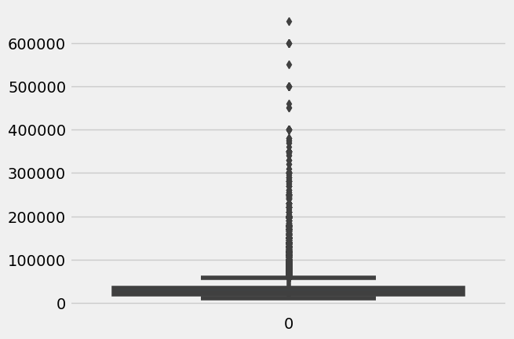
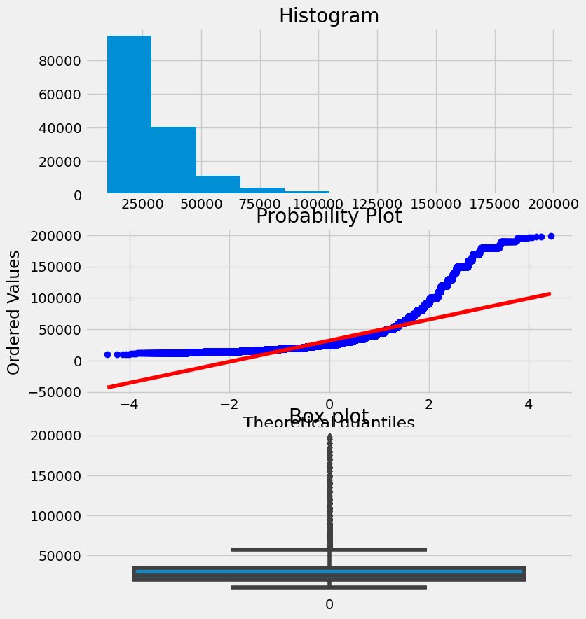
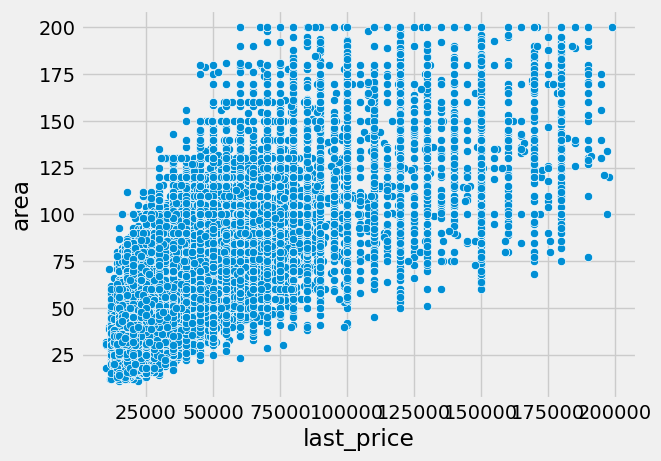
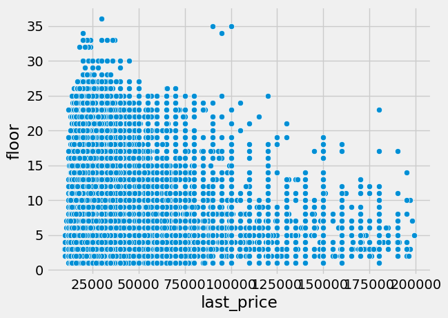
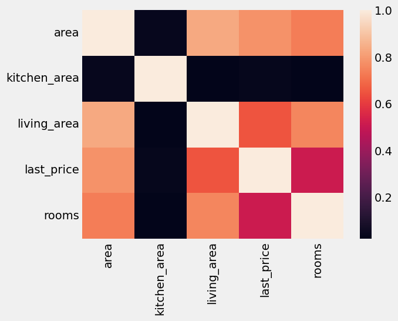
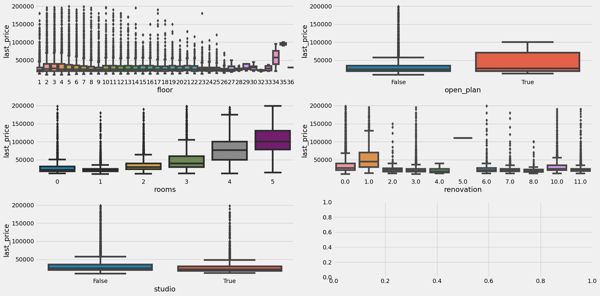
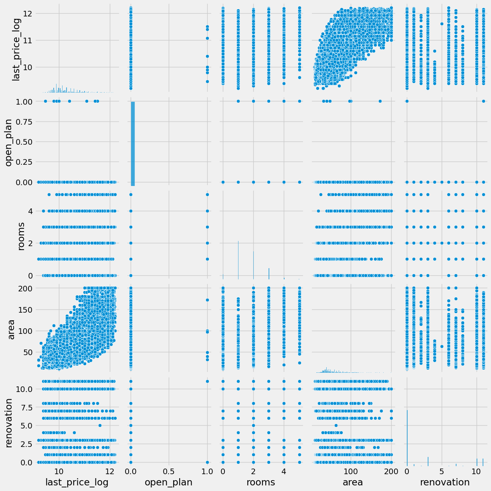

# Rent price predicting web-service
## Source data and some statistics
We have data from Yandex.Realty classified https://realty.yandex.ru containing real estate listings for apartments in St. Petersburg and Leningrad Oblast from 2016 till the middle of August 2018.
### Prepared cleaned dataset with RENT data in St.Peterburg without Oblast

Fist we have installed all nessesary libraries for analysis.
```
import pandas as pd
import seaborn as sns
import scipy.stats as stats
import matplotlib.style as style
from matplotlib import pyplot as plt
import math
from sklearn.metrics import mean_squared_error
```
And we looked at some plots and statistics.
```
sns.boxplot(rent_df_cleaned['last_price'])
```


Cleaned some of the outliers.
```
rent_df_cleaned = rent_df_cleaned[rent_df_cleaned['last_price']<200000] #rent_df_cleaned['last_price'].quantile(0.997)=200000

def visualize_property(df, feature):
    fig, axs = plt.subplots(3, figsize = (8,10))
    #Histogram plot
    axs[0].set_title('Histogram')
    df[feature].hist(ax = axs[0])
    #QQ plot 
    axs[1].set_title('QQ')
    stats.probplot(df[feature], plot=axs[1])
    ##Box plot 
    axs[2].set_title("Box plot")
    sns.boxplot(df[feature], ax = axs[2])
    print("Skewness: %f" % df[feature].skew())
    print("Kurtosis: %f" % df[feature].kurt())

visualize_property(rent_df_cleaned, 'last_price')
```


We also dealt with missing values. Deleted not significant columns. And took data only for the city not the oblast.
```
rent_df_cleaned.drop(columns=['offer_id','price_per_sq_m','house_price_sqm_median'], inplace=True)
```
Explored relations between different features. Build correlation heatmap.







We found out some categorical features and analysed how price peneds on them.
```
categorical = ['floor','open_plan','rooms','renovation','studio']
```


We dropped some more useless columns.
```
rent_df_cleaned.drop(columns=['kitchen_area','living_area','building_id','floor','studio'], inplace=True)
```

And after that we analysed the features that left.


And saved the data as cleaned dataset.
```
rent_df_cleaned.to_csv('cleaned_dataset.csv', index=False)
```
## Information about the model
First also imported lybraries
```
import pandas as pd
import numpy as np
import seaborn as sns
import scipy.stats as stats
import matplotlib.style as style
from matplotlib import pyplot as plt
```
We splitted the dataset on train and test. And found the best ML model based on the metrics of MAE, MSE, RMSE. We tried such models as **decision tree model**, **linear regression**, **random forest regressor**, **CatBoost**. The best model was found using GridSearchCV.
```
from sklearn.model_selection import GridSearchCV

# Create a dictionary of hyperparameter values to try
param_grid = {
    'n_estimators': [10, 20, 30, 50, 100, 200],
    'bootstrap': [True, False],
    'max_depth': [5, 10, 15],
    'min_samples_split': [2, 3, 4],
    'max_features': [1, 2, 3]
}

# Create a RandomForestRegressor object
random_forest_model = RandomForestRegressor()

# Perform grid search
grid_search = GridSearchCV(random_forest_model, param_grid, cv=5)
grid_search.fit(X_train, y_train.ravel())

# Get the best parameters
best_params = grid_search.best_params_
print(best_params)
```
The best hyperparametrs are: {'bootstrap': True, 'max_depth': 5, 'max_features': 2, 'min_samples_split': 2, 'n_estimators': 200}.

Trained the best model.
```
random_forest_model = RandomForestRegressor(n_estimators=200,
                                    bootstrap=True,
                                    max_depth=5,
                                    min_samples_split=2,
                                    max_features=2)
random_forest_model.fit(X_train, y_train.ravel())
predictions = random_forest_model.predict(X_valid)
print('MAE:', metrics.mean_absolute_error(y_valid, predictions))
print('MSE:', metrics.mean_squared_error(y_valid, predictions))
print('RMSE:', np.sqrt(metrics.mean_squared_error(y_valid, predictions)))
```
>MAE: 0.3531311898234595 \
MSE: 0.3799039944882525\
RMSE: 0.6163635246250807

The parametrs to predict price are the following: open_plan, rooms, area, renovation.

Saved the model, encoder and the scaler as a pipeline.
```
import joblib

model_file = 'model.pkl'
scaler_x = 'scaler_x.pkl'
scaler_y = 'scaler_y.pkl'
joblib.dump(sc_X, scaler_x)
joblib.dump(sc_y, scaler_y)
joblib.dump(random_forest_model, model_file)
```

## How to install instructions and run the app with virtual environment
All the nessesary libraries are saved in the [requirements.txt](requirements.txt).
>blinker==1.8.2\
click==8.1.7\
flask==3.0.3\
importlib-metadata==7.1.0\
itsdangerous==2.2.0\
jinja2==3.1.4\
joblib==1.4.2\
MarkupSafe==2.1.5\
numpy==1.24.4\
scikit-learn==1.2.2\
scipy==1.10.1\
threadpoolctl==3.5.0\
werkzeug==3.0.3\
zipp==3.19.0\

## Dockerfile and it’s content
The content of the Dockerfile.
```
FROM ubuntu:20.04
MAINTAINER Mariia Cherkunova
RUN apt-get update -y
COPY . /opt/gsom_predictor
WORKDIR /opt/gsom_predictor
RUN apt install -y python3-pip
RUN pip3 install -r requirements.txt
CMD python3 app.py
```
So it allows us to run our web service from ubuntu using Docker.

## How to open the port in remote VM
In terminal run 
```
sudo ufw allow 7778
```
## How to run app using docker and which port it uses
In terminat run 
```
sudo docker run --network host -d cherkunova/gsom_e2e24:v.0.1
```
After that as the app uses the port 7778 run in terminal
```
sudo ufw allow 7778
```
